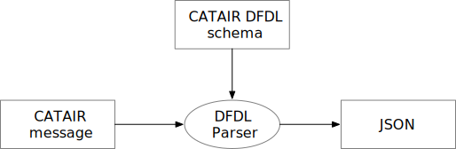

## DFDL Schema: catair

Most new systems have to exist in a legacy ecosystem, including the ability to process legacy data formats. We do not want a new system to have to deal directly with a legacy formats, preferring to use a modern data format such as XML, JSON, or S-expressions. Instead of using a custom parser, we can use the  [Data Format Description Language (DFDL)](https://daffodil.apache.org/docs/dfdl/) to describe the legacy format. This repository describes the application of DFDL and [Apache Daffodil](https://daffodil.apache.org) to the problem of parsing messages using the format for the ACE Automated Broker Interface (ABI) CBP and Trade Automated Interface Requirements (CATAIR), which is a fixed-field 80 column format described in detail at [catair](https://www.cbp.gov/trade/ace/catair).

🚧 This site is under construction. I am currently devoting 4-8 hours per week on it using 1-week sprints. 🚧

❖❖❖

### Related patterns

* Microservice.
* Pipes and filters.
* 

### Change log

| Week | Start date | Description                                                                                                                                                                                                                                                                                                                                                                                                                      |
|------|------------|----------------------------------------------------------------------------------------------------------------------------------------------------------------------------------------------------------------------------------------------------------------------------------------------------------------------------------------------------------------------------------------------------------------------------------|
| 0    | 2024-05-20 | Create initial DFDL schema. Provide details for Batch control header, provide only sketch for batch control trailer and block control elements. Define batch/block nesting structure. Begin defining other records. Set up github repository. Commit initial code to and ensure it compiles and runs one test case - note that this test case is not a valid CATAIR but will be updated over time. Begin editing main README.md. |

© 2024 Stephen W. Strom